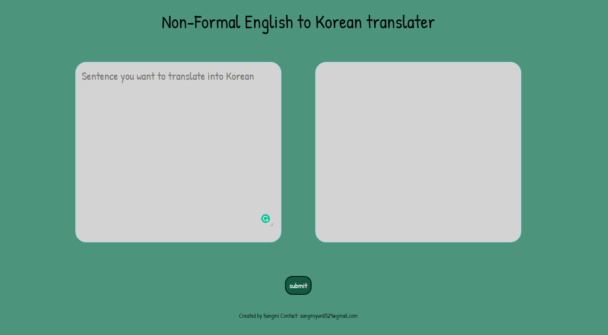

## Description 

This is an react website deployed with Netlify 

It is a website that people can translate English in to Korean which is Non-formal way.

Help people to talk with thier Korean friends and learn Korean in a more practical way

## User story 

```
AS AN person who wants to talk with more Korean friends in normal situation
I WANT to have program that can do more precise translations
SO THAT I can easily talk with my Korean friends without difficulties
```

## Acceptance Criteria

```
GIVEN a single-page Non-formal English Korean Translator Website
WHEN I load the site
THEN I can see two text areas, one is the part that I can type and the other is the one that shows the result.  
```

## Language

HTML, CSS, JavaScript, Node.js

## Usage 

This traslating website is created with React.js.

To start the APP 

npm i => npm run start

## Live Website

https://koreantranslator.netlify.app

## App ScreenShot



## Contact 

Sangmi Yun: sangmiyun0529@gmail.com
